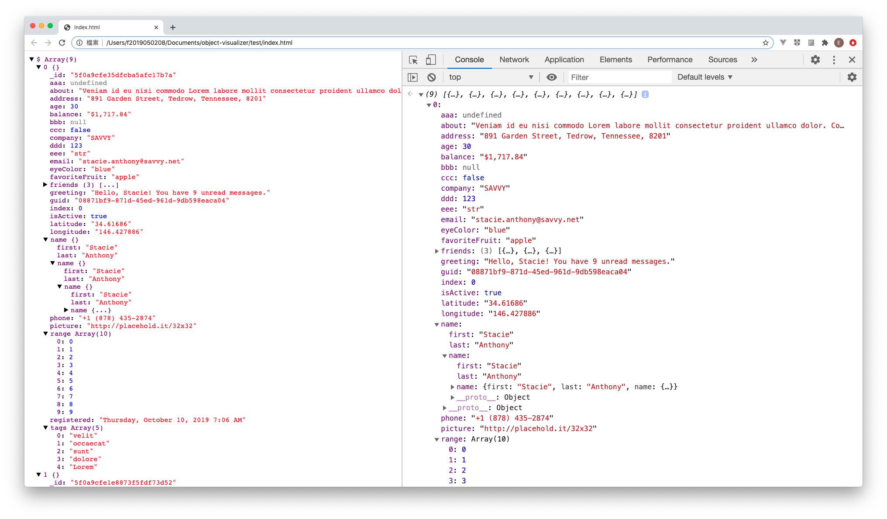

# Object Visualizer

Visualize the JSON object to the DOM.

## Live Demo

[](https://codesandbox.io/s/object-visualizer-5bji4)

## Feature

Nested values

- Recursive expand `Meta+Click`
- Recursive collapse `Meta+Shift+Click`

## Installation

```
$ npm install object-visualizer
```

```html
<script src="https://unpkg.com/object-visualizer"></script>
<link
  type="text/css"
  rel="stylesheet"
  href="https://unpkg.com/object-visualizer/dist/index.css"
/>
```

## How to use

1. Import the **mount** function from the module

```js
import { mount } from "object-visualizer";
```

2. Query the HTML element to inject the JSON, e.g. `<pre id="app"></pre>`

```js
//Vanilla JS
const preEl = document.getElementById("app");
//Vanilla JS new dom api
const preEl = document.querySelector("#app");
//jQuery
const preEl = $("#app");
```

3. Have your data on a variable

```js
const data = {};
```

> Optional: To make DOM reactivity, just wrap your data via reactive function before mount it.

```js
import { reactive } from "object-visualizer";

const data = reactive({});
```

4. Use mount function

```js
mount(data, preEl);
```

5. Thats it!!

## License

[MIT](https://github.com/iendeavor/object-visualizer/blob/master/LICENSE)
