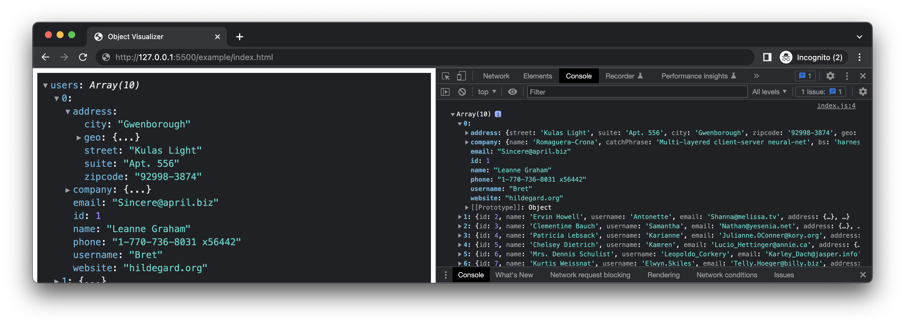
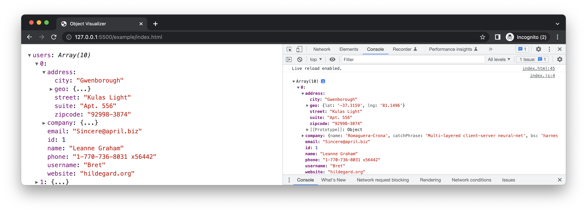

# Object Visualizer

A vue component to visualize the JSON object to the DOM.


[](https://www.paypal.com/paypalme/iendeavor)

## Live Demo

[](https://codesandbox.io/s/object-visualizer-5bji4)
[](https://codesandbox.io/s/object-visualizer-5bji4)

## Feature

- `getKeys`: customize visible keys in any nested data
- `expandOnCreatedAndUpdated`: expand or collapse after created or updated

  > Starting from v4.0.0, this feature is only available for objects due to performance issues.

  - Recursive expand `Meta+Click`
  - Recursive collapse `Meta+Shift+Click`

- Light/Dark mode

## Installation

### NPM

```
$ npm install object-visualizer
```

```ts
import { ObjectVisualizer } from 'object-visualizer'
import 'object-visualizer/dist/index.min.css'
```

### CDN

```html
<script src="https://unpkg.com/object-visualizer"></script>
<link
  type="text/css"
  rel="stylesheet"
  href="https://unpkg.com/object-visualizer/dist/index.min.css"
/>

<script>
  const { ObjectVisualizer } = window.ObjectVisualizer
</script>
```

## Usage

```vue
<ObjectVisualizer
  :data="['foo', 'bar']"
  rootName="Data"
  :expandOnCreatedAndUpdated="(path) => false"
  :getKeys="(object, path) => Object.keys(object)"
></ObjectVisualizer>
```

## License

[MIT](https://github.com/iendeavor/object-visualizer/blob/master/LICENSE)

## Donate

If this library helped you out feel free to donate.

<a href="https://www.buymeacoffee.com/iendeavor"></a>
